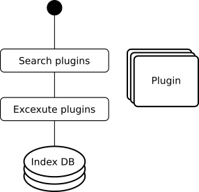

# Indexer
The main task of the indexer is to perform different analysis steps and to store the individual features in a database. The system can be extended by several different plugins.





## Plugin Structure

```python
import numpy as np

from plugins import FeaturePlugin
from plugins import export_feature_plugin


@export_feature_plugin('TestFeature')
class TestFeaturePlugin(FeaturePlugin):

    def __init__(self):
        pass

    def call(self, image):
        print('TestPlugin')
        return np.array([1,2,3], dtype=np.float32)
```

```bash
sudo docker run -t --rm -p 8500:8500 -v "/home/springsteinm/tmp/kaggle_iart_densenet_201_export/:/models/kaggle_iart_densenet_201_export" -e MODEL_NAME=kaggle_iart_densenet_201_export tensorflow/serving
```

## Compose Up
First change the bind paths in `docker-compose.yml` to absolut paths on your system.

To test the services simply type:

```bash
docker-compose up --build
```

You can omit the `--build` flag and all images will still be created if they don't exist.
If you make changes to the projekt you will need to either include the `--build` flag or manually run the following:

```bash
docker build . -t iart/indexer
```
